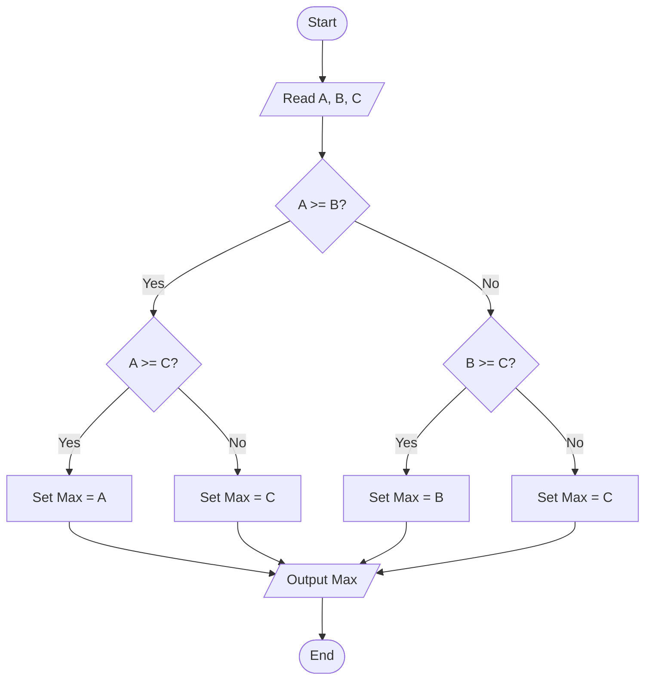
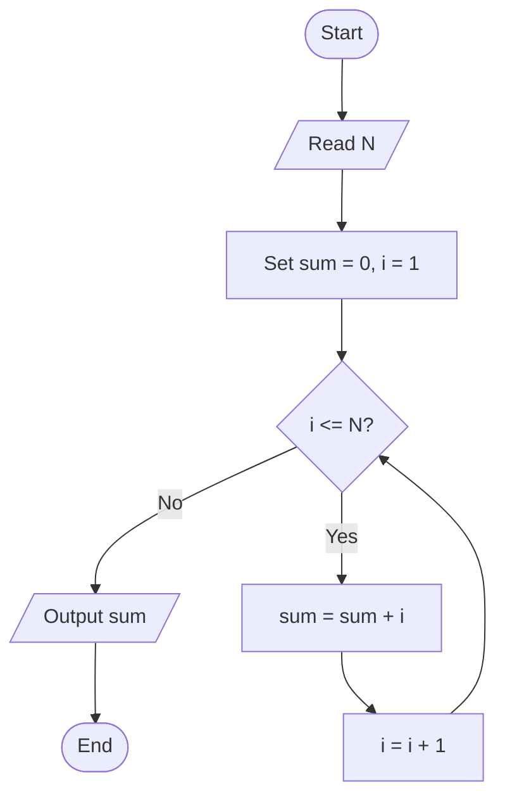

# Algorithm and Flowchart (2025 Guide)

This practical guide explains what an algorithm and a flowchart are, how they differ, what symbols to use, and how to convert an algorithm into a flowchart with clear examples. Mermaid flowcharts are provided for quick visualization.

> Key phrase focus: algorithm and flowchart, algorithm vs flowchart, flowchart symbols, pseudocode vs flowchart, algorithm to flowchart examples

---

## What is an Algorithm? What is a Flowchart?

- Algorithm: A finite, ordered set of unambiguous steps that transforms inputs into outputs. Good algorithms are correct, efficient, and terminate.
- Flowchart: A diagrammatic representation of an algorithm or process using standardized symbols and directional arrows.

---

## Algorithm and Flowchart: Differences and When to Use

- Representation
  - Algorithm: textual steps or pseudocode
  - Flowchart: graphical structure using shapes and arrows
- Readability & teaching
  - Algorithms are concise and map readily to code
  - Flowcharts are highly visual and great for teaching, reviews, and communication
- Maintainability
  - Text is easier to version and refactor for complex logic
  - Flowcharts excel for overview; very large charts can be hard to maintain

Tip: Use both. Start with pseudocode to clarify logic, then draw a flowchart for presentation or documentation.

---

## Standard Flowchart Symbols for algorithm and flowchart (Minimal Set)

- Terminator (Start/End): rounded rectangle or oval
- Process: rectangle, a processing step
- Decision: diamond, a branching condition (Yes/No)
- Input/Output (Data): parallelogram
- Connector (On-page/Off-page): small circle or labeled connector for long flows
- Flowline/Arrow: shows direction of control

Best practices:
- Keep one entry and one exit where possible
- Label decision branches (Yes/No)
- Prefer top-to-bottom or left-to-right flow
- Split very large diagrams into linked subflows

---

## Pseudocode vs Flowchart in the context of algorithm and flowchart

- Pseudocode: closer to programming languages; ideal for step refinement and quick iteration
- Flowchart: better for explaining logic visually to non-programmers
- Choice depends on audience and artifacts: exams, specs, code reviews, or teaching materials

---

## From Algorithm to Flowchart: Step-by-Step

1) Write the algorithm in short, numbered steps
2) Identify inputs/outputs, decisions, and loops
3) Map steps to symbols: Terminator → Process → Decision → I/O
4) Choose a consistent flow direction (top-to-bottom)
5) Add arrows and branch labels; verify all paths terminate

---

## Worked Examples of algorithm and flowchart (with Mermaid Flowcharts)

### Example 1 — Max of three numbers (A, B, C)

Algorithm (text):
1) Read A, B, C
2) If A >= B then compare A with C else compare B with C
3) Output the maximum



---

### Example 2 — Linear search (array arr of length n, target x)

Algorithm (text):
1) i ← 0
2) While i < n: if arr[i] == x then report Found and stop; else i ← i + 1
3) If loop ends, report Not Found

```mermaid
flowchart TD
  S([Start]) --> Init[Set i = 0]
  Init --> D{i < n?}
  D -- No --> NF[/Output "Not Found"/]
  D -- Yes --> C{arr[i] == x?}
  C -- Yes --> F[/Output "Found at i"/]
  C -- No --> Inc[Set i = i + 1]
  Inc --> D
  NF --> E([End])
  F --> E
```

---

### Example 3 — Sum of first N natural numbers

Algorithm (text):
1) Read N
2) sum ← 0, i ← 1
3) While i ≤ N: sum ← sum + i; i ← i + 1
4) Output sum



---

## Advantages and Disadvantages of algorithm and flowchart

- Algorithm
  - Pros: precise, easy to convert to code, compact
  - Cons: less visual; harder for non-technical audiences
- Flowchart
  - Pros: visual clarity, great for teaching and reviews
  - Cons: can become large; maintenance cost for complex logic

---

## Conclusion: how algorithm and flowchart work together

Use algorithms (or pseudocode) for precise logic and iteration, and flowcharts for communication, teaching, and quick visual checks. In practice, combining both yields the best results.

---

*References*
- Wikipedia — Flowchart: https://en.wikipedia.org/wiki/Flowchart
- GeeksforGeeks — Introduction to Flowcharts: https://www.geeksforgeeks.org/competitive-programming/an-introduction-to-flowcharts/
- Microsoft Support — Create a basic flowchart in Visio (symbols overview reference): https://support.microsoft.com/en-us/office/create-a-basic-flowchart-in-visio-e207d975-4a51-4bfa-a356-eeec314bd276

