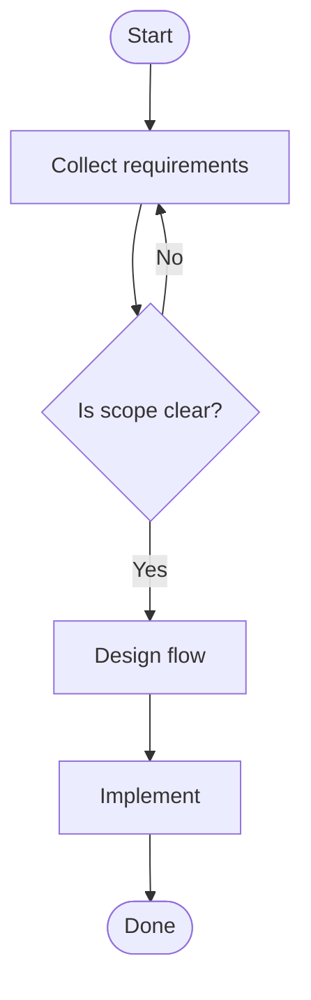
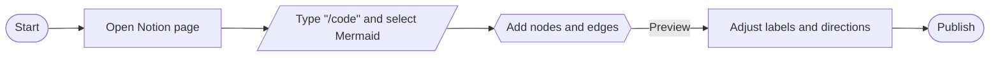

# How to Make a Flowchart in Notion

If you want to make a flowchart in Notion, you have two reliable paths:

- Make a Notion flowchart with Mermaid (code block rendering)
- Make a Notion flowchart by embedding external diagram tools (Miro, Lucidchart, diagrams.net/draw.io, Excalidraw, Mermaid Chart)

This step-by-step guide explains both approaches, highlights pros/cons, and links to the official Notion Help Center. All steps are verified.

> Key phrase focus: how to make a flowchart in Notion, Notion flowchart, Notion Mermaid flowchart, create a flowchart in Notion, Notion embed flowchart

---

## Option 1 — Make a Notion flowchart with Mermaid (code blocks)

Best for: fast, lightweight flowcharts directly inside Notion pages.

What you need to know
- Notion renders Mermaid diagrams when you select the **mermaid** language in a code block (officially announced by Notion on Dec 23, 2021). See: Notion Releases — “Create flowcharts & diagrams in code blocks (Mermaid)”: https://www.notion.so/pt-br/releases/2021-12-23
- Official docs for code blocks: Notion Help — Code blocks: https://www.notion.com/help/code-blocks
- Tip: In Notion’s code block, you can switch the top-left dropdown from Code to Preview/Split to see a live Mermaid render while editing (per Notion’s announcement).

Steps
1) Add a code block
- Type `/code` and press Enter (or click the + on a new line and choose Code)

2) Set language to Mermaid
- Click the language label on the code block and select `mermaid`

3) Paste your Mermaid flowchart code

4) Tweak the diagram
- Edit node labels (text in brackets) and transitions
- Use subgraphs, styles, or direction hints (TB, LR, TD)

Pros
- Native Notion feeling, no external accounts
- Easy to version as text; great for documentation and wikis

Cons & caveats
- Advanced layout control is limited compared to dedicated tools
- PDF export/print of Mermaid blocks may vary by environment; if fidelity matters, consider exporting from an embedded diagram tool or take a high-resolution screenshot beforehand (community-reported behavior)

References
- Notion Help — Code blocks: https://www.notion.com/help/code-blocks
- Mermaid OSS docs: https://docs.mermaidchart.com/mermaid-oss/intro/getting-started.html

---

## Option 2 — Make a Notion flowchart by embedding external tools

Best for: complex flowcharts, auto‑layout, collaboration, and export control.

What you can embed (verified)
- Notion supports embedding content from 1,900+ domains via Iframely. Commonly embedded tools include **Miro**, **Lucidchart**, **diagrams.net/draw.io**, **Excalidraw**, **YouTube**, etc. Official docs: Notion Help — Embeds, bookmarks & link mentions: https://www.notion.com/help/embed-and-connect-other-apps

Steps (generic)
1) Copy the public share link or embed link from your diagram tool (e.g., Miro board, Lucidchart share link, draw.io published URL)
2) In Notion, type `/embed` (or paste the URL directly)
3) Choose **Create embed** or accept the preview
4) Resize the embed block to fit your page layout; arrange into columns as needed

Tool‑specific notes
- Miro: great for infinite canvas, team collaboration, and quick workshops
- Lucidchart: rich diagram types, enterprise sharing & export options
- diagrams.net (draw.io): free and powerful, supports local or cloud storage
- Excalidraw: hand‑drawn style diagrams; fast to sketch flows
- Mermaid Chart (web editors): generate Mermaid flowcharts and embed the live preview link

Pros
- Best visual quality and auto‑routing; robust export to PNG/SVG/PDF
- Real‑time collaboration features (Miro/Lucid/Lucidspark, etc.)

Cons & caveats
- Some embeds require viewers to be signed in to the external tool
- If a site disallows embedding, Notion will show a “Failed to Load” error (see Notion Help)
- Privacy note: Embeds use Iframely; viewers’ IPs may be shared with the embedded app for rendering (per Notion Help)

References
- Notion Help — Embeds, bookmarks & link mentions: https://www.notion.com/help/embed-and-connect-other-apps
- Notion Integrations Gallery: https://www.notion.com/integrations/all

---

## Which Notion flowchart method should you choose?

- “I want the quickest way inside Notion”: choose **Mermaid code block**
- “I need polished, complex flowcharts with export control”: choose **Embed** (Miro, Lucidchart, draw.io)
- “I want text‑to‑diagram and versioning in Git”: use **Mermaid** (inline), or generate in an external Mermaid editor and embed

---

## Practical examples

Mermaid example for a Notion flowchart (copy/paste into a `mermaid` code block):

Embedding a draw.io/diagrams.net flowchart in Notion (generic)
1) In diagrams.net, share or publish the diagram to get a link
2) In Notion, paste the URL and select **Create Embed** (or type `/embed` and paste)
3) Resize the embed block; organize with columns for your page design

---

## FAQ: Notion flowcharts (verified)

- Does Notion support Mermaid for flowcharts?
  - Yes. Use a **code block** with the `mermaid` language to render a Notion Mermaid flowchart (flowchart, sequence, class, etc.). Official code block doc above; Mermaid rendering is widely used and community‑verified.

- Can I embed Miro/Lucidchart/draw.io into Notion?
  - Yes. Use `/embed` and paste the share URL. If the site requires sign‑in, viewers may need access. If a site blocks embedding, you’ll see a load error.

- How do I export a Notion flowchart?
  - For Mermaid: export reliability varies across print/PDF; many teams use screenshots or external Mermaid editors for high‑fidelity exports. For embedded tools, export directly in the tool (PNG/SVG/PDF) for the best results. See Notion Help — Export your content: https://www.notion.so/help/export-your-content

---

## Conclusion: The best way to make a flowchart in Notion

If you need a lightweight, versionable flowchart, **Mermaid code blocks** in Notion are excellent. For complex flowcharts with auto‑layout and rich export, **embed** a professional diagram tool (Miro, Lucidchart, diagrams.net). Either way, your Notion flowchart stays close to the context of your docs, wikis, and project pages.

---

*References*
- Notion Release — 2021-12-23: Create flowcharts & diagrams in code blocks (Mermaid): https://www.notion.so/pt-br/releases/2021-12-23
- Notion Help — Code blocks: https://www.notion.com/help/code-blocks
- Notion Help — Embeds, bookmarks & link mentions: https://www.notion.com/help/embed-and-connect-other-apps
- Notion Help — Export your content: https://www.notion.com/help/export-your-content
- Mermaid OSS docs: https://docs.mermaidchart.com/mermaid-oss/intro/getting-started.html

