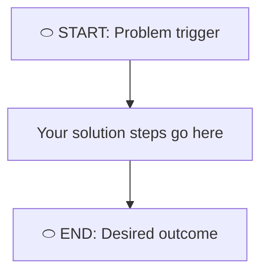
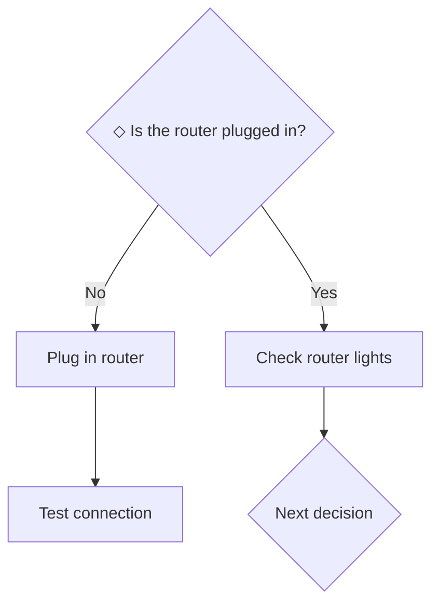
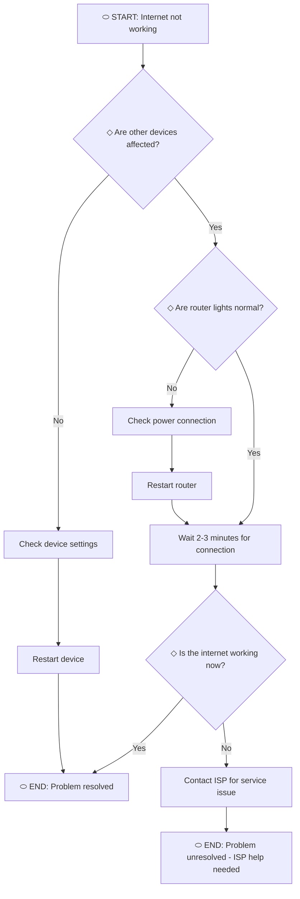
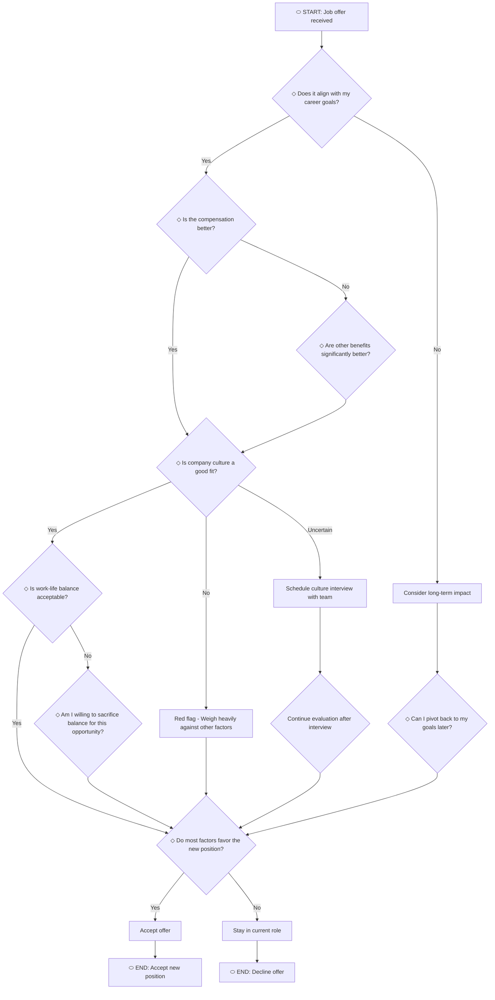
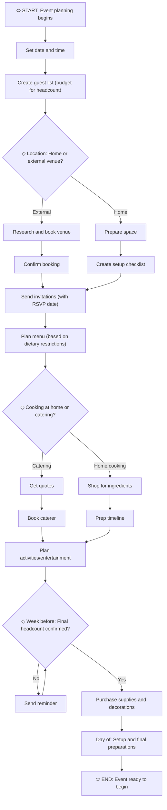

# Master Problem-Solving: Create Your Own Flowchart (A Practical DIY Guide for Clarity & Action)

## Introduction: Unlock Problem-Solving Clarity

Are you stuck on a tough problem? Maybe you’ve tried a few solutions, but nothing seems to work and frustration is setting in. This happens to everyone—complex challenges can make decisions difficult and slow down your progress.

There is a better way. By using a clear problem-solving flowchart, you can break any issue into simple steps and make decisions with confidence. The key takeaway: building your own flowchart moves you from confusion to action, helping you solve problems more easily.

Want to see how AI can turn your ideas or even images into flowcharts in seconds? FlowchartAi lets you generate one free every day—no signup hoops, just instant clarity. [[Try FlowchartAi free](https://flowchartai.org/)].

## What is a Problem-Solving Flowchart? (And Why You Need One)

A problem-solving flowchart is a visual tool that shows each step, decision, and possible outcome in order. Think of it as your personal **decision-making GPS. It helps you see** where you are, what choices you have, and where each option could lead.

Unlike traditional list-making or mental brainstorming, a flowchart maps the entire landscape of your problem in a single view, showing not just what needs to happen, but also the critical decision points that determine your path forward.

### **Why You Absolutely Need Flowcharts:**

**Clarity and Visualization:** Flowcharts make problems visible. When a challenge exists only in your mind, it’s easy to lose track of details or miss important links. A flowchart organizes your thoughts into a clear, visual structure you can work with.

**Systematic Approach:** Our brains are great at generating ideas, but not so good at keeping track of every detail in complex processes. Flowcharts help by making sure every step is written down, every option is considered, and every decision is clear.

**Improved Decision-Making:** Each decision point in your flowchart encourages you to think about the results of every choice before you move forward. This careful approach helps you make better decisions and avoid regrets.

**Efficiency & Time-Saving:** By identifying bottlenecks, redundancies, and unnecessary steps upfront, flowcharts help you streamline your approach. You'll stop wasting time on dead-end solutions and focus your energy where it actually matters.

**Enhanced Collaboration:** When working with others, a flowchart provides a shared understanding that transcends lengthy explanations. Everyone can literally see the same picture, reducing miscommunication and aligning team efforts.

**Error Reduction:** Spotting logical flaws on paper is infinitely easier than discovering them mid-implementation. Flowcharts let you test drive your solution before committing resources.

**DIY Advantage:** The best part is that making your own flowcharts puts you in charge. Takeaway: You have the control and tools to create your own solutions.

### **The Science Behind Visual Problem-Solving**

Our brains process visual information much faster than text. When you turn a complex problem into a flowchart, you use your brain’s natural strengths. Visual diagrams help you spot patterns, connections, and solutions that are hard to see in plain text.

Flowcharts work because they match the way we naturally solve problems. At each step, we ask ourselves, "What happens next?" and "What if?" This approach breaks down complex issues into smaller, manageable pieces that are easier to understand and remember.

##  Beyond the Diagram: How to 'Think' Like a Flowchart

Creating a flowchart is more than just drawing boxes and arrows. It's about building a new way of thinking that changes how you solve problems. When you start to "think like a flowchart," you teach yourself to break down complex issues, anticipate possible outcomes, and make clearer decisions.

### **The Mental Shift: From Overwhelm to Structure**

Most people approach problems emotionally. They see the whole tangled mess at once and feel paralyzed. Flowchart thinking teaches you to step back and ask: "What's the very first step?" Then: "What happens after that?" And: "What decision needs to be made here?"

Thinking in order turns big, overwhelming problems into smaller, manageable steps. Instead of trying to fix everything at once, you just focus on the next step, and then the one after that.

### **Logical Sequencing: Training Your Brain to See Cause and Effect**

Flowcharts naturally show cause and effect. When you make one decision, it leads to a certain path and then to a result. This clear mapping helps you think a few steps ahead, much like a chess player planning future moves.

With practice, this way of thinking becomes a habit. You’ll start to ask yourself, "If I do this, what happens next?" before you act, which leads to better decisions.

### **Circumventing Cognitive Biases**

One of the most powerful (yet overlooked) benefits of flowchart thinking is how it helps you overcome cognitive biases that sabotage problem-solving:

· **Confirmation Bias:** When you map out all possible paths (not just the ones you prefer), you're forced to objectively evaluate options you might otherwise dismiss.

· **Anchoring Bias:** By visualizing the entire process, you prevent yourself from fixating on the first solution that comes to mind.

· **Sunk Cost Fallacy:** A flowchart helps you evaluate decisions based on future outcomes, not past investments.

The structure of flowcharts encourages you to look at things objectively. Every path leads somewhere, and every decision has clear rules. This approach helps you avoid emotional or rushed choices.

### **Improving Analytical Reasoning Through Visualization**

When you put your thoughts on paper or a screen, you free up mental space. Your mind doesn't have to keep track of every detail because everything is visible in front of you. This lets you focus on weighing your options and finding the best path, instead of just trying to remember your ideas.

**Expert Insight:** "Define the Problem Clearly: Before drawing, spend time articulating the problem statement precisely. A well-defined problem is half-solved." Taking time upfront to clarify exactly what you're solving prevents the common trap of building an elaborate solution to the wrong problem.

**Expert Insight:** "Focus on Outcomes, Not Just Steps: Ensure each branch of your flowchart leads to a clear outcome or decision, pushing the problem towards resolution." Every path should have a destination—whether that's a solution, a next decision, or a clear endpoint. Avoid creating flowcharts that meander without purpose.

##  Essential Flowchart Symbols for Problem-Solving

Standardized symbols are the universal language of flowcharts. Like road signs that everyone can understand, these flowchart symbols make your diagrams easy to read, whether you review them months later or share them with your team. If you are confused about symbols or want to learn more, we also have a detailed [flowchart symbol guide](https://flowchartai.org/blog/flowchart-symbols-guide).

Understanding these core symbols is crucial for DIY success. Here are the essential building blocks:

|                       |                        |                                                                                                            |
| --------------------- | ---------------------- | ---------------------------------------------------------------------------------------------------------- |
| **⬭ (Oval)**          | **Terminator**         | Marks the start or end of your problem-solving process. Every flowchart needs clear entry and exit points. |
| **▭ (Rectangle)**     | **Process**            | Represents a specific action, task, or step you must complete. This is where work happens.                 |
| **◇ (Diamond)**       | **Decision**           | Shows a critical point where a choice must be made, with multiple paths based on the answer.               |
| **→ (Arrow)**         | **Connector**          | Indicates the direction of flow and the sequence of steps. Arrows guide the reader through your logic.     |
| **▱ (Parallelogram)** | **Input/Output**       | Represents data or information entering the process (input) or being produced (output).                    |
| **● (Circle)**        | **On-Page Connector**  | Connects different parts of a flowchart on the same page when lines would become cluttered.                |
| **⌂ (Home Plate)**    | **Off-Page Connector** | Links to another part of the flowchart on a different page for complex, multi-page processes.              |
**Pro Tip:** You don't need to memorize every specialized symbol. For most DIY problem-solving, you'll primarily use four key tools: 'The Starter Oval' (Terminator), 'The Action Rectangle' (Process), 'The Gatekeeper Diamond' (Decision), and 'The Navigator Arrow' (Connector). Master these four, and you can tackle 90% of problems effectively.

Consistency is important. After you pick your symbols, use them the same way in your whole flowchart. This creates a visual language that feels natural as you solve the problem.

## Step-by-Step Guide: How to Create Your Own Problem-Solving Flowchart

Ready to build your first flowchart? Here’s a quick overview of the six-step process to guide you from problem identification to a complete visual roadmap. Key takeaway: follow these steps to simplify complex problems and create clear action plans.

If you want to turn complicated text or even images into a clear visual instantly, give [FlowchartAi](https://flowchartai.org/) a try—just paste your prompt or upload an image, and get a perfect, editable flowchart. You can try it for free (one chart every day) right now!

### Step 1: Define the Problem Clearly

**This is the most important step.** Rushing past problem definition is the #1 reason flowcharts fail to deliver results. You can't solve what you don't understand.

**Articulating the Problem Statement:** Use the classic journalism questions to crystallize your thinking:

· **What** is the problem? (Be specific, not vague)

· **Where** does it occur? (Context matters)

· **When** does it happen? (Always? Sometimes? Under what conditions?)

· **Who** is affected? (Understanding stakeholders shapes solutions)

· **Why** is this a problem? (What's the actual impact?)

· **How** severe is it? (Priority level)

**Setting the Scope:** Draw clear boundaries around what you're addressing. What's included in your flowchart? What's explicitly out of scope? This prevents scope creep and keeps your diagram focused.

**Self-Reflection Questions:**

· "Am I solving the symptom or the underlying cause?"

· "What would success look like?"

· "What assumptions am I making?"

**Expert Reminder:** "Define the Problem Clearly: Before drawing, spend time articulating the problem statement precisely. A well-defined problem is half-solved."

### Step 2: Identify Your Start and End Points

Every journey needs a beginning and a destination.

**Where does the problem begin?** Identify the initial trigger or symptom that signals the problem exists. This becomes your "Start" terminator. It might be an error message, a customer complaint, a missed deadline, or a personal frustration.

**What does a successful resolution look like?** Describe the "end state"—the specific outcome that signals the problem is solved. This becomes your "End" terminator. Be concrete: "Internet working properly" is better than "Problem fixed."

**Visual Reference:** Your flowchart framework looks like this:

 This simple structure sets the limits for everything else you will include in your flowchart.

### Step 3: Brainstorm All Potential Steps

Now comes the creative phase. List every single action, task, or consideration involved in addressing the problem. Don't worry about order yet—just capture everything.

Ask yourself:

· What actions need to be taken?

· What information needs to be gathered?

· What checks or tests need to happen?

· What could go wrong?

· What alternatives exist?

Use sticky notes, a simple list, or mind mapping—choose whatever helps you jot down ideas quickly. At this stage, focus on getting as many ideas as possible. You can organize and improve them in the next step.

**Expert Reminder:** "Start Simple, Iterate Often: Don't aim for perfection on the first try. Sketch out a basic flow, then refine and add detail as your understanding evolves."

Imagine you're facing a minor issue like organizing your weekly grocery shopping. You start by jotting down a basic flowchart, outlining just the key steps: plan meals, check pantries, list items, shop. Initially, you realize the process is too broad, so you test it by planning your next meal. After using it, you notice you forgot to account for budget constraints. You then update your flowchart, adding steps for reviewing weekly sales and setting a budget. By iterating and refining, your simple grocery flowchart evolves into an efficient, personalized tool that saves you time each week.

### Step 4: Sequence Your Steps Logically

Time to bring order to the chaos. Take your brainstormed list and arrange the steps in logical sequence:

1. Start with your "Start" terminator.

2. Add the first action or process (rectangle) that must happen.

3. Connect it with an arrow.

4. Add the next step

5. Continue building the flow.

At this stage, you'll mostly use process boxes (rectangles) and arrows. Don't worry about making it perfect right now. This is just a rough draft; you can improve it later.

**Visual Progress:** Your flowchart starts taking shape as you connect actions in sequence, showing the natural progression from problem to solution.

### Step 5: Add Decision Points and Outcomes

This is where flowcharts truly shine. Look at your sequence and identify every point where a question must be answered or a choice must be made. These become diamond-shaped decision symbols.

**Using Decision Diamonds Effectively:**

Every decision should have at least two clear paths, such as "Yes/No," "True/False," or specific options like "Option A/B/C." Try to avoid choices that are vague or unclear.

**Mapping Consequences:** Each path from a decision diamond leads somewhere:

· Another process step

· Another decision point

· An endpoint (problem solved or different outcome)

· Sometimes, back to an earlier step (creating a loop for retries)

**Expert Reminder:** "Identify All Decision Points: Every diamond (decision symbol) should have at least two clear paths (e.g., Yes/No, True/False) to guide the user."

**Example:**

### Step 6: Review, Test, and Refine

Your first draft is done! Now it's time to make it even better:

**Review for Clarity:** Can someone else follow your flowchart without explanation? Is the language clear and unambiguous?

**Test Completeness:** Walk through your flowchart with different scenarios:

· The happy path (everything works perfectly)

· Common errors or obstacles

· Edge cases or unusual situations

**Check Logical Consistency:** Do all paths lead somewhere? Are there any dead ends? Does every decision account for all possible answers?

**Expert Reminder:** "Test Your Flowchart: Mentally walk through your flowchart with a hypothetical scenario or an actual problem to identify logical gaps or redundancies."

**Look for Redundancies:** Are you repeating steps unnecessarily? Can any processes be consolidated?

**Get Feedback:** If the problem affects others, share your flowchart and ask for their perspective. Fresh eyes catch what you miss.

**Expert Reminder:** "Don't Be Afraid to Revise: Flowcharts are living documents. As you learn more about the problem or find better solutions, update your flowchart."

### **Interactive Challenge: Flowchart Your Own Problem Right Now**

Let's put theory into practice immediately. Pause and work through this quick exercise. Before mapping it out, think about why solving your chosen small problem matters to you personally. Consider what achieving this resolution will mean for your daily life, your stress levels, or your personal satisfaction. Understanding its intrinsic value will enhance your focus and commitment to resolving it.

**Challenge Prompt:** Think of a small, everyday problem you're facing right now. It could be deciding what to make for dinner, troubleshooting a household issue, or planning your week.

**Guided Steps:**

1. **Define your problem in one sentence:** ____________________________________

2. **What's your ideal outcome?** _______________________________

3. **What's the very first step you can take?** _______________________________

4. **What's the first decision you might encounter, and what are its paths?**

o Decision: _______________________________

o Path 1: _______________________________

o Path 2: _______________________________

5. **Continue mapping** mentally or on paper as you read the rest of this guide.

The best way to learn how to think in flowcharts is to practice. This simple exercise helps you start building the habit of solving problems step by step.

## Practical DIY Examples: Flowcharts in Action

Theory is valuable, but examples bring concepts to life. Here are three real-world scenarios showing how flowcharts transform confusion into clarity.

### Example 1: Troubleshooting Home Wi-Fi Issues

**Scenario:** Your internet isn't working, and you need to get back online quickly.

**Flowchart Breakdown:**

**Why This Works:** Rather than guessing at solutions, the flowchart leads you through logical steps. You rule out each possibility one by one until you either solve the problem or know it's time to call for help.

Want to [make your own flowchart](https://flowchartai.org/blog/How-to-Use-Flowchart-AI-Make-Flowcharts-Instantly-from-Text) from scratch or even from an image? Try [FlowchartAi](https://flowchartai.org/)—it specializes in creating precise flowcharts, not as a side feature, but as the main event. Your first daily flowchart is on us.

### Example 2: Career Decision - Evaluating a Job Offer

**Scenario:** You've received a job offer and need to decide whether to accept it or stay in your current role.

**Flowchart Breakdown:**

**Why This Works:** Career decisions have many factors to consider. The flowchart helps you look at each part carefully, so you don't get distracted by just one appealing detail, like salary, and miss other important issues, such as company culture.

### Example 3: Planning a Small Event or Project

**Scenario:** You're organizing a casual social gathering and need to coordinate multiple moving parts.

**Flowchart Breakdown:**

**Why This Works:** Planning an event means some tasks depend on others. For example, you need to know how many people are coming before you can plan the food. The flowchart helps you remember every step and keeps everything in the right order.

### Downloadable Templates for Immediate Use

Ready to hit the ground running? Here are three practical templates you can adapt to your specific needs:

**Template 1: "Troubleshooting Tech Issues"** Perfect for diagnosing problems with printers, computers, smartphones, or any technology. Pre-built with common diagnostic steps, you can customize.

**Template 2: "Personal Decision Matrix"** Ideal for major life choices like buying a car, choosing a service provider, or making a significant purchase. Includes decision criteria and weighted factors.

**Template 3: "Simple Project Workflow"** Great for managing small projects like home improvements, content creation, or personal goals. Maps out planning, execution, and review phases.

**[Download All Three Templates Here](https://cdn.flowchartai.org/problem-solving-blog-images/Problem-Solving-Flowchart-Templates.md)** _(Get your complete flowchart template package)_

## Best Practices for Effective Problem-Solving Flowcharting

Now that you understand the basics, let's elevate your flowcharting skills with these proven best practices.

### 1. Keep Language Simple and Direct

**Expert Reminder:** "Keep It Concise: Use clear, unambiguous language within each symbol. Avoid lengthy descriptions that can clutter the diagram."

Use short, action-oriented phrases:

· ✅ Good: "Restart computer"

· ❌ Poor: "Please proceed to restart your computer system by shutting down all applications first."

Avoid jargon unless your audience is guaranteed to understand it. Remember: clarity beats cleverness every time.

### 2. Maintain Consistency Throughout

**Expert Reminder:** "Use Consistent Symbols: Adhere to standard flowchart symbols (e.g., rectangles for processes, diamonds for decisions) for clarity and universal understanding."

· Use the same symbol for the same type of element every time.

· Keep formatting consistent (same colors, fonts, sizing)

· Maintain consistent spacing between elements.

· Use the same language style throughout (all imperative voice: "Check settings," not mixing with "Settings are checked")

Being consistent makes your flowchart look professional and makes it easier for others to understand.

### 3. Balance Detail Appropriately

Know when to drill down and when to generalize. Too much detail creates overwhelming clutter; too little leaves critical gaps.

**Rule of thumb:** If a process box contains more than 7-10 words, consider breaking it into multiple steps, or consider whether you're overexplaining.

For complex sub-processes, use an off-page connector to link to a detailed sub-flowchart rather than cramming everything onto one diagram.

### 4. Collaborate for Better Results

**Expert Reminder:** "Involve Relevant Stakeholders: For complex or shared problems, collaborate with others. Different perspectives can uncover overlooked steps or solutions."

When problems affect multiple people:

· Share draft flowcharts early for feedback.

· Use collaborative tools for real-time input.

· Welcome questions and challenges to your logic

· Document differing viewpoints that emerge

The most robust flowcharts incorporate diverse perspectives, revealing blind spots and edge cases you might miss working solo.

### 5. Stress-Test with Different Scenarios

**Expert Reminder:** "Consider Edge Cases: Think about unusual or less common scenarios that might arise. Does your flowchart adequately address these possibilities?"

Walk through your flowchart multiple times with different scenarios:

· The ideal scenario (everything goes right)

· Common problems (the usual hiccups)

· Worst-case scenarios (when Murphy's Law strikes)

· Unusual edge cases (rare but possible situations)

If your flowchart gets stuck or ends without a clear result in any situation, keep revising it until every path makes sense and leads somewhere.

## Common Mistakes to Avoid When Building Your Flowchart

Learn from others' errors. Avoid these six pitfalls that trip up even experienced flowchart creators.

### Mistake #1: Overcomplicating the Initial Draft

**The Problem:** Trying to capture every nuance and detail in your first attempt leads to analysis paralysis and abandoned flowcharts.

**The Solution:** Begin with a broad and simple outline. Write down the main steps and decisions first. You can add more details later. A finished simple flowchart is better than a perfect one that never gets done.

### Mistake #2: Creating Ambiguous Decision Points

**The Problem:** Decision diamonds with unclear paths, such as "Maybe," "Depends," or "Sometimes," don't actually guide decision-making.

**The Solution:** Every decision must have clear, mutually exclusive, and collectively exhaustive options. If you can't clearly answer the question with the available paths, reformulate the decision.

· ❌ Poor: ◇ "Should I proceed?" → Maybe

· ✅ Good: ◇ "Do all prerequisites meet minimum requirements?" → Yes / No

### Mistake #3: Misusing Symbols

**The Problem:** Using process rectangles for decisions, or decision diamonds for actions, creates confusion and misinterpretation.

**The Solution:** Stick strictly to standard symbol meanings:

· Rectangles = Actions/processes

· Diamonds = Questions/decisions requiring a choice

· Ovals = Start/end points only

If you're unsure, check the symbol guide again. Staying consistent is important.

### Mistake #4: Ignoring Edge Cases and Exceptions

**The Problem:** If you only design your flowchart for the ideal situation, you won't be ready when things go wrong—and they often do.

**The Solution:** Actively brainstorm what could go wrong, what unusual circumstances might occur, and how rare situations should be handled. Add decision points and alternative paths for these scenarios.

Ask: "What if this step fails?" "What if the data is missing?" "What if the user chooses an unexpected option?"

### Mistake #5: Skipping the Testing Phase

**The Problem:** Assuming your first draft is correct without validation leads to discovering flaws only when applying the flowchart to real situations.

**The Solution:** Always test with multiple scenarios before considering your flowchart complete. Walk through it step by step, playing out different "what if" situations. Even better, have someone unfamiliar with the problem try to follow your flowchart without your guidance.

### Mistake #6: Missing Clear Start and End Points

**The Problem:** Flowcharts that begin or end ambiguously leave users confused about when to use them and when they're done.

**The Solution:** Always use terminator symbols (ovals) to explicitly mark:

· **START:** The specific trigger or condition that initiates the process

· **END:** The specific outcome or resolution that completes the process

Multiple endpoints are acceptable (representing different outcomes), but each must be clearly labeled.

## When to Reach for a Problem-Solving Flowchart

Flowcharts aren't necessary for every problem—sometimes a simple list or quick decision suffices. Here's when flowcharts deliver the most value.

### Complex, Multi-Step Problems

When your problem involves numerous sequential actions, dependencies between steps, or requires coordination across multiple phases, flowcharts provide clarity that lists cannot match.

**Examples:**

· Project planning with multiple stakeholders

· IT troubleshooting with many variables.

· Hiring processes with screening stages

· Complex customer service protocols

**Why Flowcharts Help:** They show you which steps depend on others, where things might get stuck, and the most important path to follow. You can see not just what needs to happen, but also the right order and conditions for each step.

### Repetitive Issues Requiring Consistent Approaches

When the same problem occurs regularly and needs a standardized response, flowcharts create repeatable processes that ensure consistency and quality.

**Examples:**

· Customer onboarding procedures

· Quality control inspections

· Routine maintenance protocols

· Recurring monthly closing processes

**Why Flowcharts Help:** They save you from having to figure things out from scratch every time, help prevent mistakes by using the same process, and make it much easier to train new people.

### Situations Requiring Team Alignment

When multiple people need to understand and execute the same process, flowcharts provide shared understanding that transcends verbal explanations.

**Examples:**

· Cross-functional project workflows

· Collaborative problem-solving sessions

· Documenting team procedures

· Explaining complex processes to stakeholders

**Why Flowcharts Help:** Pictures are quicker and clearer than long explanations. When everyone can see the same diagram, it's easier to avoid misunderstandings.

### Root Cause Analysis

When you need to go beyond surface symptoms to identify underlying causes, flowcharts help you systematically work backward from effects to causes.

**Examples:**

· Investigating why projects consistently run over budget

· Determining why customer complaints spike at certain times

· Analyzing why certain marketing campaigns underperform

**Why Flowcharts Help:** They force systematic consideration of all factors and relationships. Why Flowcharts Help: They make you look at every factor and connection, so you don't stop at the first explanation that seems to fit. actors, potential outcomes, and interdependencies, flowcharts structure the decision-making process and reveal the implications of each choice.

**Examples:**

· Career transitions or job changes

· Major purchases (home, vehicle, equipment)

· Business strategy decisions

· Resource allocation choices

**Why Flowcharts Help:** They prevent emotional decision-making by forcing systematic evaluation of all factors and their downstream consequences.

## Tools to Create Your Problem-Solving Flowchart (Digital & Analog)

The tool doesn't make the flowchart—your thinking does. Start with whatever is most accessible, and upgrade only if complexity demands it.

### Analog Tools: Pen and Paper / Whiteboard

**The DIY Champion:** Don't underestimate the power of analog tools. Some of the best flowcharts start as rough sketches.

**Benefits:**

· Zero learning curve—start immediately

· No cost or software required

· Encourages free-form, creative thinking

· Perfect for brainstorming and early drafts

· Easily collaborative (gather around a whiteboard)

· No technology barriers or distractions

**Best For:**

· Initial brainstorming sessions

· Simple personal problems

· Solo problem-solving

· Quick visualization of concepts

· When technology isn't available

**Pro Tip:** Use a whiteboard for problems you'll iterate on quickly; use paper for flowcharts you want to keep and refer back to.

### Digital Tools: Professional Yet Accessible

Once you've validated your approach with analog tools or need to share professionally, digital tools offer polish and functionality.

**FlowchartAi – The Purpose-Built Flowchart Solution**

Overview: If you want a tool that’s dedicated to flowcharts (and only flowcharts), FlowchartAi is the streamlined answer. It uses AI to turn your plain-English prompts or even images into accurate, editable flowcharts in seconds. No clutter, no side-tools—just pure flowchart focus. You get one flowchart free every day, so you can try it hands-on for your real challenges.

Key Features:

• AI-powered: Generate flowcharts from text or images—instantly.

• Simple, distraction-free interface (no unnecessary features).

• Built specifically for flowcharts—no bloat, no multipurpose clutter.

• Free daily use—no sign-up hoops.

• Image-to-flowchart conversion for whiteboard photos, sketches, and more.

Best For:

• Students, professionals, or anyone who wants to solve problems visually—fast.

• Anyone tired of wrestling with multi-tool platforms that treat flowcharts as an afterthought.

• Users who value a tool that “just works” for its single purpose.

[Pricing](https://flowchartai.org/pricing): One free flowchart per day. Simple, fair pricing for more.

**Lucidchart** - _The Template Powerhouse_

**Overview:** Popular online diagramming tool with extensive flowchart capabilities and collaboration features.

**Key Features:**

· Massive template library (start with pre-built structures)

· Real-time collaboration (multiple people editing simultaneously)

· Integration with Google Workspace, Microsoft Office, Slack

· Easy export to PDF, PNG, or embed in documents

· Intuitive drag-and-drop interface

**Best For:**

· Professional diagrams for business use

· Team projects requiring collaboration

· Complex flowcharts with many elements

· When you need polished, presentation-ready results

**Pricing:** Free plan available with limited features; paid plans for full functionality.

**Miro** - _The Collaborative Whiteboard_

**Overview:** Online collaborative whiteboard platform that excels at visual problem-solving and brainstorming.

**Key Features:**

· Infinite canvas (never run out of space)

· Sticky notes, diagrams, and free-form drawing combined

· Excellent for workshops and team brainstorming

· Video chat integration for remote collaboration

· Pre-built frameworks and templates

**Best For:**

· Brainstorming sessions with teams

· Workshops and facilitated problem-solving

· Visual thinking beyond just flowcharts

· Remote team collaboration

**Pricing:** Free plan for up to 3 boards; paid plans for unlimited access.

**Draw.io / diagrams.net** - _The Free Open-Source Option_

**Overview: A** completely free, open-source diagramming tool with robust flowchart capabilities.

**Key Features:**

· Totally free with no feature limitations

· Works offline (desktop versions available)

· Integration with Google Drive, OneDrive, GitHub

· Professional-quality output

· No account required

**Best For:**

· Budget-conscious users

· Open-source enthusiasts

· Users who want full functionality without a subscription

· Anyone needing a capable, no-cost solution

**Pricing:** Completely free.

**Creately** - _The AI-Assisted Platform_

**Overview:** Visual workspace with AI-powered drawing assistance and an extensive template library.

**Key Features:**

· AI-powered smart drawing (suggests next elements)

· Real-time collaboration with team members

· Extensive template collection for various industries

· Visual project management features

· Integration with productivity tools

**Best For:**

· Businesses and educators

· Users who want intelligent drawing assistance

· Teams needing integrated project management

· Those who appreciate guided creation

**Pricing:** Free trial available; paid plans for full features.

### Choosing the Right Tool for Your Needs

**Consider these factors:**

**Complexity of the Problem:**

· Simple problems: Pen and paper suffice

· Moderate complexity: Any digital tool works

· High complexity: Choose tools with robust editing and organization (Lucidchart, Creately)

**Collaboration Requirements:**

· Solo work: Any tool, including analog

· Team collaboration: Miro, Lucidchart, or Creately

· Asynchronous sharing: Any digital tool with export/sharing

**Budget:**

· Zero budget: Pen and paper, Draw.io

· Limited budget: Free tiers of Lucidchart or Miro

· Business budget: Full versions of Lucidchart or Creately

**Desired Aesthetic:**

· Quick and functional: Pen and paper, Draw.io

· Professional presentation: Lucidchart, Creately

· Creative and visual: Miro

**Remember,** the best tool is the one you will actually use. Start simple and get comfortable with the basics. Try more advanced tools only if you really need them.

## **Conclusion:

You've just equipped yourself with a powerful method to change how you tackle problems. Problem-solving flowcharts turn big, confusing challenges into clear steps you can follow. They help you move from confusion to clarity, from hesitation to confidence, and from wasted effort to real progress. More flowcharts, problems felt like tangled knots with no clear starting point. After flowcharts, every challenge becomes a navigable map with visible decision points, alternative paths, and clear destinations.

**The benefits you'll experience:**

· **Clarity:** See the entire problem landscape in a single view

· **Efficiency:** Eliminate unnecessary steps and identify the optimal path

· **Better Decisions:** Evaluate options systematically before committing

· **Confidence:** Know you've considered all factors and contingencies

· **Replicability:** Create processes you can use again and again

· **Collaboration:** Align teams around shared understanding

But here's the important part: Knowledge is only useful if you put it into action. Flowcharts really help when you use them to solve your own problems.

**Here's your challenge:** Pick a small problem and start today. Don't wait for the perfect problem or the best tools. Just grab a pen and paper and map out that issue that's been on your mind.

· What's your problem statement?

· What's your desired outcome?

· What's the very first step?

· What's the first decision point?

Just get started. You'll be surprised at how quickly things become clearer once you put your thoughts down on paper.

**The clarity you gain will be immediate and empowering.** Problems that seemed insurmountable will become achievable. Decisions that caused anxiety will become straightforward. And you'll wonder how you ever approached challenges without this visual GPS.

Welcome to systematic problem-solving. Your flowchart journey begins now.

**Note:** _This guide's methodology and content have been reviewed by process improvement specialists to ensure practical accuracy and adherence to best practices in systematic problem-solving._

If you’ve made it this far, you probably care about solving problems the smart way—just like I do. That’s why I built FlowchartAi: to help people like us turn messy ideas, prompts, or even quick sketches into flowcharts in seconds (with a little help from AI). You can try it totally free—just to see how much easier it makes things.

[TRY FLOWCHART AI FOR FREE NOW](http://flowchartAI.org)

And honestly, I’d love to hear your thoughts or just chat about your experience! If you want to connect, swap tips, or give feedback, come join me and our friendly [Discord group](https://discord.com/invite/EhuSZNHNQh).