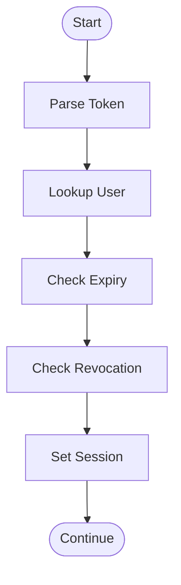
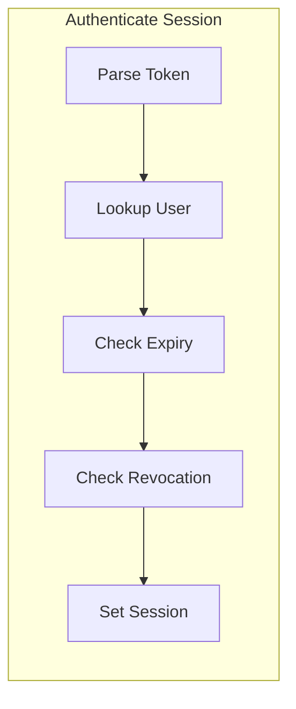

# What Is a Subprocess in a Flowchart?

A subprocess in a flowchart—also known as a predefined process or subroutine—is a reusable block that represents a well‑defined set of steps aggregated into a single symbol. Using a flowchart subprocess keeps the main flow simple, makes repeated logic consistent, and helps teams collaborate around clear boundaries.

---

## Quick navigation

- [Definition and the symbol](#definition-and-the-symbol)
- [When to use a subprocess](#when-to-use-a-subprocess)
- [How to draw a subprocess (with examples)](#how-to-draw-a-subprocess-with-examples)
- [Best practices](#best-practices)
- [Subprocess vs BPMN subprocess](#subprocess-vs-bpmn-subprocess)
- [Mermaid examples](#mermaid-examples)
- [FAQ](#faq)
- [References](#references)

---

## Definition and the symbol

In classic flowcharts, a subprocess is also called a **predefined process** or **subroutine**. The standard **subprocess symbol** (predefined process symbol) looks like a process box with **double vertical edges**, meaning the internal steps are defined elsewhere.

Common aliases and terms you’ll see:
- Subprocess in flowchart / Flowchart subprocess
- Predefined Process (standard name)
- Subroutine (software/algorithmic term)
- Reusable Process (practical alias)

How it differs from other blocks:
- vs Process: a normal Process shows an inline step; a Subprocess stands for multiple steps defined elsewhere
- vs Decision: Decision asks a question and branches; Subprocess performs a chunk of work as a unit

Tip for diagramming tools:
- In Mermaid flowcharts, a subroutine is written as `[[Text]]` (double brackets) to draw the **predefined process** double‑edged symbol.

---

## When to use a subprocess

Use a flowchart subprocess when it helps you:
- Reuse the same set of steps in multiple places (e.g., "Validate Payment", "Authorize User")
- Hide complexity from the main flow to reduce cognitive load
- Define **clear contracts** (inputs/outputs, preconditions/postconditions)
- Align team boundaries (hand‑offs between squads/systems/vendors)
- Test, measure, or replace the unit independently (versioning/migration)

When not to use it:
- One-off steps that never repeat
- Very tiny steps where the symbol would create noise
- Highly context-coupled logic that changes every time it’s used

---

## How to draw a subprocess (with examples)

A good subprocess has three parts: a clear name, an explicit input/output contract, and well‑defined failure/exception paths. When documenting a **subprocess in a flowchart**, make these visible near the **predefined process** symbol.

Recommended checklist:
- Name: action‑oriented, result‑focused (e.g., "Verify Email Token")
- Inputs/Outputs: annotate near the block or in lane notes
- Failure handling: return codes, exception branches, or retries
- Scope: single responsibility; avoid mixing unrelated concerns

### Placement patterns
- Caller → [[Reusable step]] → Next step
- Parallel callers → [[Shared step]] → Merge
- Caller → [[Reusable step]] → Decision → Alternate paths

---

## Best practices

- Keep the main flow readable; move more than ~5–7 inline steps into **subprocesses**
- Use consistent names (verb + object), and keep tense parallel across the page
- Document preconditions and outputs near the block (or in a legend)
- Prefer standard connectors; avoid cross-page "flying" arrows
- If a **subprocess** appears more than twice, consider extracting it to its own page
- Use lanes or sections to indicate ownership (team/system) when relevant

---

## Subprocess vs BPMN subprocess

Flowchart **subprocess** (predefined process):
- Visual: rectangle with double vertical edges (the **predefined process** symbol)
- Semantics: an opaque, reusable block; details live elsewhere
- Scope: informal rules; no strict event or lane semantics

BPMN **subprocess**:
- Visual: rounded rectangle often with a **plus (+)** marker; can be collapsed or expanded
- Semantics: formal behavior including events, boundaries, lanes (swimlanes), and message flows
- When to switch: regulatory workflows, system orchestration, or when events/transactions matter

---

## Mermaid examples

Below are copy-ready Mermaid snippets. If your editor supports Mermaid, paste to render.

### 1) Main flow that calls two subprocesses

```mermaid
flowchart TD
  A([Start]) --> B[Receive Order]
  B --> [[Validate Customer]]
  [[Validate Customer]] --> C{Items In Stock?}
  C -- Yes --> [[Reserve Inventory]]
  C -- No --> E[Notify Out-of-Stock]
  [[Reserve Inventory]] --> D[Create Shipment]
  D --> F([End])
```

### 2) Refactor a long sequence into a subprocess

Before (inline and noisy):



After (clean with a reusable subprocess):

```mermaid
flowchart TD
  S([Start]) --> [[Authenticate Session]]
  [[Authenticate Session]] --> O([Continue])
```

How to implement the subprocess:



---

## FAQ

### Is a subprocess the same as a function?
They’re analogous. A subprocess is like a function or module in programming: a named unit with inputs and outputs that you can reuse. But a flowchart doesn’t enforce strict type contracts—write them in notes/legends when needed.

### Can I nest subprocesses?
Yes. Keep nesting shallow—two levels are usually enough for readability. If you need deeper structures or events, consider BPMN.

### How do I show inputs and outputs?
Add small labels near connectors (e.g., "orderId", "session"). For complex contracts, include a margin note or a mini table nearby.

### What if my tool doesn’t have a predefined process symbol?
Use a regular process box and annotate it as "Subprocess"; or in Mermaid use `[[Text]]` which renders the subroutine double-edge style.

---

## References

- Wikipedia: Flowchart — Symbols and conventions
  - https://en.wikipedia.org/wiki/Flowchart
- Mermaid: Flowchart syntax (subroutine `[[text]]`)
  - https://mermaid.js.org/syntax/flowchart.html
- Lucidchart: Flowchart symbols and notation
  - https://www.lucidchart.com/pages/flowchart-symbols-meaning
- SmartDraw: Flowchart symbols
  - https://www.smartdraw.com/flowchart/flowchart-symbols.htm
- BPMN 2.0 specification (subprocess semantics)
  - https://www.omg.org/spec/BPMN

---

If you need a quick starting point, generate the first draft as a Mermaid flowchart and then expand subprocesses as your logic stabilizes. This keeps early iterations fast while preserving clarity for handoff.

